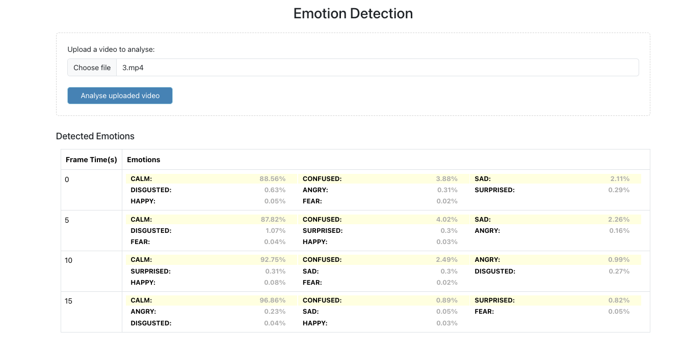

# Emotion Recognition

## Introduction
The Emotion Recognition project is designed to analyze facial expressions in video content by capturing and detecting these expressions at regular intervals of every 5 seconds. This approach allows for a detailed understanding of emotional changes over time within the video, providing insights into the dynamics of facial expressions as they evolve throughout the footage.

## Technologies Used
- **Django**: Backend framework for managing data, handling requests, and providing the necessary APIs for the application.
- **ReactJS**: Frontend library for building an interactive and responsive user interface.
- **Amazon Rekognition**: Image and video analysis service integrated to perform facial expression detection. It processes video frames at 5-second intervals, identifying and analyzing facial expressions and sending the results back to the frontend for visualization and further analysis.

## System Architecture

### AI Model Integration
#### 1. Model Selection:
- **Amazon Rekognition** was selected due to its advanced capabilities in image and video analysis. It provides robust features for detecting faces and analyzing emotions with high accuracy.
  - **Pre-trained and Scalable**: Amazon Rekognition is a fully managed service that is pre-trained and scales automatically, making it suitable for processing large volumes of video data efficiently.
  - **Accuracy and Reliability**: It offers high accuracy in emotion detection and integrates seamlessly with other AWS services.
  - **Ease of Integration**: Eliminates the need for extensive model training and tuning.

#### 2. Integration with Django:
- **Setup**:
  - **AWS SDK Integration**: The Django backend uses the `boto3` library to interact with AWS services. The `boto3` client is configured with AWS credentials and the S3 bucket details for uploading and downloading files.
  - **REST API Endpoint**: The `VideoUploadView` class in Django REST Framework (DRF) handles video uploads, processes the uploaded video file, extracts frames, and uploads these frames to S3.
  - **Facial Expression Analysis**: After uploading each frame to S3, the backend uses Amazon Rekognition's `detect_faces` API to analyze the emotions in each frame. The results are compiled and sent back to the frontend.
  - **Exception Handling**: Proper error handling and logging are implemented.

- **Workflow**:
  1. File Upload: The video file is uploaded to S3 via the Django backend.
  2. Frame Extraction: The video is processed to extract frames at 5-second intervals.
  3. Frame Upload: Each extracted frame is uploaded to S3.
  4. Emotion Detection: Amazon Rekognition analyzes each frame to detect emotions.
  5. Response Preparation: The results are compiled and sent back to the frontend.

#### 3. Interaction with ReactJS:
- **User Interaction**:
  - **File Upload**: Users interact with the ReactJS frontend to upload a video file.
  - **Status Display**: The frontend displays a loading state while the video is being processed.
  
- **Data Retrieval and Display**:
  - **Receive Response**: The backend sends the emotion detection results back to the ReactJS frontend.
  - **Results Display**: The frontend updates the UI to display the results in a tabular format, including the time of the frame and the detected emotions with their confidence levels.
  - **Error Handling**: Errors are displayed to the user through alerts or notifications.

## Results and Discussion

### User Interaction Screens

### Results for Desktop View

### Results for Mobile View

## Conclusion
This project demonstrates the effective use of AI and cloud-based services for real-time emotion recognition from video content. The integration of Django, ReactJS, and Amazon Rekognition provides a robust solution for analyzing facial expressions in video data.

